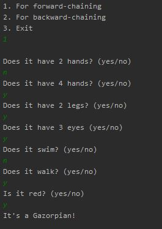
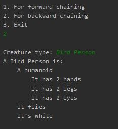

# Luna City expert system
A system that can detect tourists.

## Table of contents
* [General info](#general-info)
* [Screenshots](#screenshots)
* [Technologies](#technologies)
* [Setup](#setup)
* [Features](#features)

## General info
In order to detect tourists on luna city an expert system was developed that has a set of rules for 
each tourist. At the moment there are 11 creatures in the database, but it can be extended easily.
The set of all rules is also known as knowledge database. It can be found in the main function in 
```main.py```.


## Screenshots
Bellow you can see an example of forward chaining



And an example with backward chaining



## Technologies
The project doesn't use any dependencies. To use it you will need only Python 3.7

## Setup
In the project directory run: ```python main.py```

## Features
* Forward chaining
* Backward chaining