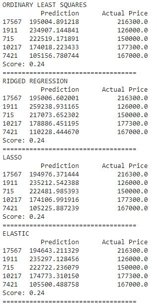

# Linear Regression system
A system that can predict house prices.

## Table of contents
* [General info](#general-info)
* [Screenshots](#screenshots)
* [Technologies](#technologies)
* [Setup](#setup)
* [Features](#features)

## General info
The system creates a linear model for the given data in order to predict house price based on five parameters. 
The parameters are: age, total rooms, total bedrooms, how much inhabitants are there and number of apartments in a complex. 
Specifically the system uses four linear model methods, they are: ordinary least squares, rigged, lasso and elastic regression.

## Screenshots
The result:

## Technologies
- Python 3.7
- Scikit-learn
- Pandas
- Google colab
